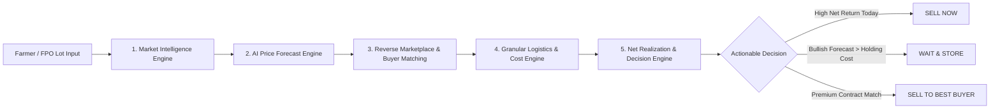
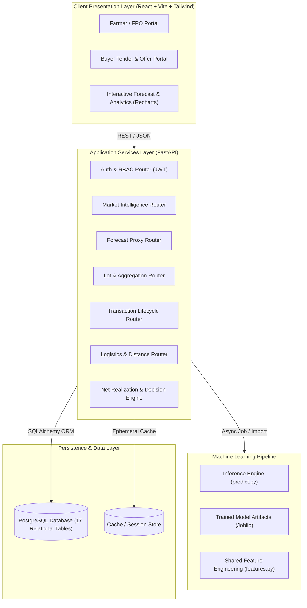

# 🌾 KrishiDisha (कृषि दिशा)

> **Strengthening Market Linkages & Price Discovery for Farmers**  
> *Smart India Hackathon (SIH) 2026 — Problem Statement ID: 26132*  
> **Team:** MakhanChor (IIIT Sri City)

---

[](https://fastapi.tiangolo.com)
[](https://reactjs.org)
[](https://vitejs.dev)
[](https://tailwindcss.com)
[](https://www.python.org)
[](https://www.postgresql.org)
[](https://opensource.org/licenses/MIT)

---

## 📌 Executive Summary & Core Philosophy

In traditional agricultural commerce, farmers and Farmer Producer Organizations (FPOs) face severe information asymmetry. Headline prices at distant mandis often mislead producers into distress sales because they omit the hidden deductions: haulage logistics, loading/unloading fees, mandi cesses, and quality re-grading risks.

### The Core USP
> **"We don't optimize for the highest headline price. We optimize for the farmer's highest NET REALIZATION."**

KrishiDisha moves agricultural producers from raw price awareness to **actionable decision intelligence** — forecasting where prices are trending, scoring compatible buyers, calculating real-world transit & holding costs, and delivering a clear recommendation: **SELL NOW, WAIT, or SELL TO BEST BUYER**.

$$\text{Expected Net Realization} = \text{Gross Revenue} - \text{Logistics} - \text{Storage} - \text{Handling}$$

---

## 🚀 Key Features & The 5 Core Engines



### 1. 📊 Market Intelligence Engine
* Aggregates real-time mandi prices, daily arrivals, and historical volume trends across APMC mandis and e-NAM.
* Provides multi-market price comparisons within customizable radiuses (25km, 50km, 100km+).

### 2. 🤖 Predictive AI Price Forecast Engine
* Delivers 7-day to 14-day bounded price interval forecasts (upper/lower confidence limits).
* Powered by time-series architectures (Prophet, LightGBM, XGBoost) trained on longitudinal commodity price records.
* Avoids misleading point predictions by exposing probabilistic confidence intervals and directional momentum.

### 3. 🤝 Reverse Marketplace & Buyer Matching Engine
* Eliminates commission agent monopolies by directly connecting farmers/FPOs with institutional food processors, aggregators, and exporters.
* **Dual-Stage Matching:** Strict parameter validation (commodity, variety, moisture $\le 12\%$, delivery window) followed by multi-factor weighted scoring (offered price, distance, buyer reliability, payment terms).

### 4. 🚚 Granular Logistics & Storage Cost Engine
* Real-world road routing and distance calculations using Open Source Routing Machine (OSRM).
* Accurate freight estimation based on vehicle payload classes (Tata Ace, 407, 16-wheeler) and regional per-km tariffs.
* Integrates nearby state/private warehousing options with daily holding rates and crop decay factors.

### 5. ⚖️ Net Realization & Decision Engine
* Synthesizes market rates, buyer bids, transit expenses, and storage overhead into a unified net return figure.
* Formulates transparent economic recommendations: **SELL NOW / WAIT / BEST BUYER**.
* **Bulk Aggregation Hub:** Enables FPOs to pool smallholder lots into high-volume commercial shipments while preserving full farmer contribution traceability.

---

## 🏛️ System Architecture



---

## 📁 Repository Structure

```text
KrishiDisha/
├── .agents/                      # Autonomous Multi-Agent Governance Framework
│   ├── config.yaml               # CLI agent command definitions & scopes
│   ├── README.md                 # Agent matrix and permissions
│   ├── SYSTEM_ARCHITECT.md       # Master system architect persona & constraints
│   ├── BACKEND_DATABASE_AGENT.md # Backend engineer persona & deliverables
│   ├── FRONTEND_AGENT.md         # Frontend engineer persona & UI specs
│   ├── ML_DATA_PIPELINE_AGENT.md # ML engineer persona & model topologies
│   └── BUSINESS_LOGIC_AGENT.md   # Mathematical formulation & logic persona
├── Backend/                      # FastAPI Core Application
│   ├── app/
│   │   ├── config.py             # Application & environment configuration
│   │   ├── main.py               # FastAPI entry point & middleware
│   │   ├── database/             # SQLAlchemy connection pool & seed scripts
│   │   ├── models/               # 17 PostgreSQL ORM models
│   │   ├── schemas/              # Pydantic validation schemas
│   │   ├── routes/               # Modular REST endpoints
│   │   └── services/             # Core business & algorithmic engines
│   └── ml/                       # Machine Learning training & inference
│       ├── preprocessing.py      # Data cleaning & anomaly detection
│       ├── features.py           # Shared feature extraction pipeline
│       ├── train.py              # Time-series training script
│       ├── evaluate.py           # Backtesting & metrics (MAE, RMSE, MAPE)
│       └── predict.py            # Bounded inference service
├── Frontend/                     # React.js Client Application
│   └── src/
│       ├── App.jsx               # Application root & routing
│       ├── main.jsx              # React DOM entry point
│       ├── index.css             # Tailwind base styles
│       ├── components/           # Reusable UI component library
│       ├── pages/                # Role-based dashboards & workflow pages
│       ├── hooks/                # Custom React state hooks
│       ├── services/             # Centralized Axios API client
│       └── utils/                # Number, currency & date formatters
├── Information/                  # Master Specifications & References
│   └── EXECUTION_PLAN.md         # 700+ line technical execution plan
└── README.md                     # Project documentation
```

---

## 🤖 Autonomous Multi-Agent Framework

This project is built using an **Autonomous Multi-Agentpair-programming framework** managed in [`.agents/`](file:///D:/KrishiDisha/.agents/):

| Agent Identifier | Role | CLI Command | Write Scope |
|---|---|---|---|
| **`system_architect`** | Master System & Software Architect | `/SYSTEM_ARCHITECT` | `Architecture/`, Docs |
| **`frontend_agent`** | Lead Frontend & UI/UX Engineer | `/FRONTEND_AGENT` | `Frontend/` |
| **`backend_database_agent`** | Lead Backend Engineer & DB Architect | `/BACKEND_DATABASE_AGENT` | `Backend/` |
| **`ml_data_pipeline_agent`** | ML & Temporal Data Pipeline Engineer | `/ML_DATA_PIPELINE_AGENT` | `Backend/ml/` |
| **`business_logic_agent`** | Algorithmic & Economic Logic Engineer | `/BUSINESS_LOGIC_AGENT` | `Backend/app/services/` |

---

## 🛠️ Getting Started

### Prerequisites
* **Python 3.11+**
* **Node.js 18+** & **npm**
* **PostgreSQL 14+**

---

### 1. Backend Setup (FastAPI)

```bash
# Navigate to the backend directory
cd Backend

# Create and activate a virtual environment
python -m venv venv
# On Windows:
.\venv\Scripts\activate
# On Linux/macOS:
source venv/bin/activate

# Install dependencies
pip install fastapi uvicorn sqlalchemy psycopg2-binary pydantic python-jose passlib python-multipart pandas scikit-learn

# Run database migrations / seed data
python -m app.database.seed_data

# Start the FastAPI server
uvicorn app.main:app --reload --port 8000
```
* Interactive API Documentation will be live at: `http://localhost:8000/docs`

---

### 2. Frontend Setup (React + Vite)

```bash
# Navigate to the frontend directory
cd Frontend

# Install node dependencies
npm install

# Start the local development server
npm run dev
```
* The web portal will be accessible at: `http://localhost:5173`

---

## 👥 Team: MakhanChor

* **Institution:** Indian Institute of Information Technology, Sri City (IIIT Sri City)  
* **Event:** Smart India Hackathon (SIH) 2026  
* **Problem Statement ID:** 26132 — *Strengthening market linkages and price discovery for farmers*  

---

## 📄 License

This project is open-source under the [MIT License](LICENSE).
